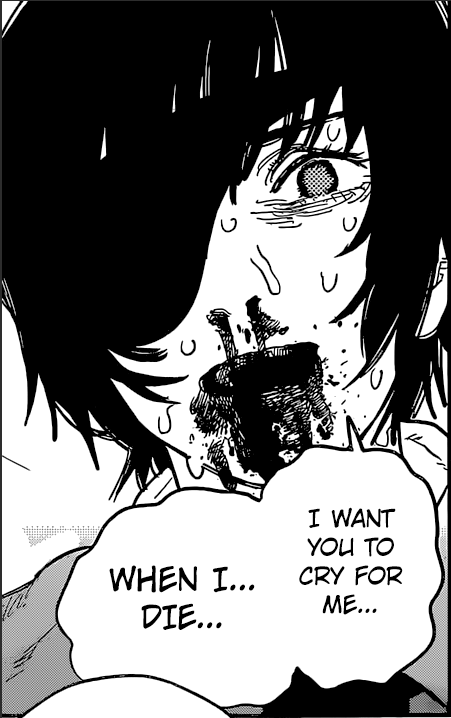
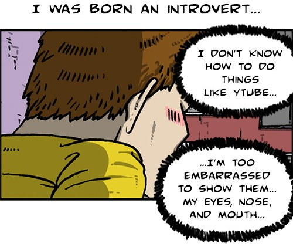
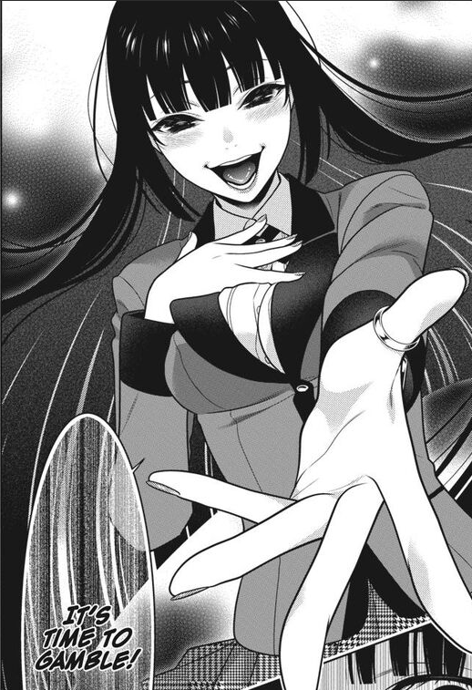

This website offers a perspective of the universe that occupies Ducky. It's a beautiful thing but handle it with caution because it's addicting, weird, and epic...it's a black hole.  

  

For now, I will only have **4** categories: _Experiences_, _Learning_, _Music_, and _Projects_ through which I'll organize my thoughts. Experiences is obviously the random thotties and worldly discoveries that I'll entertain with y'all. The projects I engage in will also correlate to learning modules I put out. You can think of the projects as the intermediate outputs of different phases of learning in whichever field I'm currently obsessing over. While I'm obsessing over something I'm also vibing in another symbiotic or chaotic manner. I'll provide a glimpse of that through the music I'm currently listening to or thinking about.

Go blast off into the Duckiverse. You'll prolly be scarred and enlighted but fuck it same shit right? I'm like 25th Bam but muttering dark gory struggles as I wreck for the crew. Life's a gamble...risk it.

